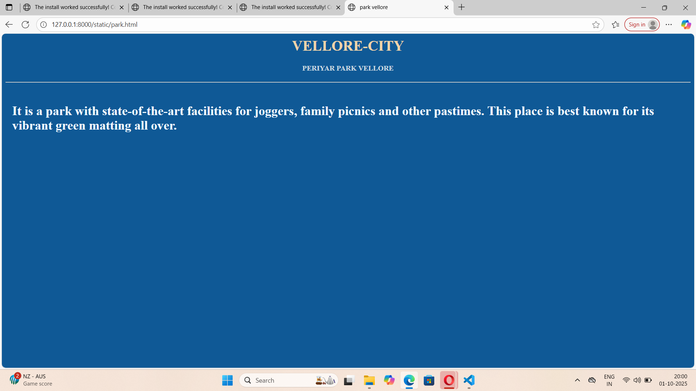

# Ex04 Places Around Me
## Date: 27/09/25

## AIM
To develop a website to display details about the places around my house.

## DESIGN STEPS

### STEP 1
Create a Django admin interface.

### STEP 2
Download your city map from Google.

### STEP 3
Using ```<map>``` tag name the map.

### STEP 4
Create clickable regions in the image using ```<area>``` tag.

### STEP 5
Write HTML programs for all the regions identified.

### STEP 6
Execute the programs and publish them.

## CODE 
```
<html>
    <head>
        <title>
            map-Vellore
        </title>
    </head>
    <body>
        
        <h1 style="color:red" align="center" >VELLORE CITY</h1>
        <h4 align="center" style="color:blue;">LEKHASHRI E (25008477) </h4>
        
<map name="image-map">
    <area target="" alt="jagakandeswarar temple" title="jagakandeswarar temple" href="temple vellore" coords="691,366,96" shape="circle">
    <area target="" alt="benzz park" title="benzz park" href="hotel" coords="869,152,1066,220" shape="rect">
    <area target="" alt="gs mahal" title="gs mahal" href="hall" coords="192,355,153,383,188,415,300,418,323,383,289,354,289,356,244,352,246,355" shape="poly">
    <area target="" alt="sajra fort" title="sajra fort" href="fort" coords="1201,251,1371,310" shape="rect">
    <area target="" alt="periyar park" title="periyar park" href="park" coords="731,491,918,562" shape="rect">
</map>
    </body>
</html>
temple.html
<html>
    <head>
        <title>
             
        </title>
    </head>
    <body bgcolor="lightblue" >
        <h1 align="center" style="color: rgb(103, 84, 56);">VELLORE-CITY</h1>
        <h4 align="center" style="color: rgb(68, 67, 65);">JALAGANDEESHWARAR TEMPLE</h4>
        <hr>
        <p style="margin: 15px; font-size: 28 "><b>
             The fort houses the Jalakanteswarar Hindu temple, the Christian St. John's Church and a Muslim mosque, of which the Jalakanteswarar Temple is famous for its magnificent carvings. The first significant military rebellion against British rule, the Vellore Mutiny, erupted at this fort in 1806.
        </b></p>
    </body>
</html>
park.html
<html>
    <head>
        <title>
            park vellore
        </title>
        <style>
            body{
                background-color: rgb(15, 89, 150);
            }
        </style>
    </head>
    <body>
        <h1 align="center" style="color: rgb(240, 211, 169);">VELLORE-CITY</h1>
        <h4 align="center" style="color: rgb(205, 218, 226);">PERIYAR PARK VELLORE</h4>
        <hr>
        <p style="margin: 15px; color: aliceblue; align-items: center; font-size: 28 " ><b>
             <br>
          It is a park with state-of-the-art facilities for joggers, family picnics and other pastimes. This place is best known for its vibrant green matting all over.  
        </body>    
</html>
hall.html
<html>
    <head>
        <title>
             vellore marriage hall
        </title>
        <style>
            body{
                background-color: rgb(145, 175, 161);
            }
        </style>
    </head>
    <body>
        <h1 align="center" style="color: rgb(234, 203, 156);">VELLORE-CITY</h1>
        <h4 align="center" style="color: rgb(216, 211, 200);">GS MARRIAGE HALL</h4>
        <hr>
        <p style="margin: 15px; color: aliceblue; font-size: 28 " ><b>
        GS Mahal (or G S Mahal) is a banquet and marriage hall in Vellore, Tamil Nadu, that serves as a venue for various events, including weddings, birthdays, and corporate functions. It offers flexible event spaces with capacities for hundreds of guests, on-site parking, and the potential for in-house or outside catering to accommodate different needs and budgets.
        </b></p>
    </body>    
</html
fort.html
<html>
    <head>
        <title>
            sajra fort
        </title>
        <style>
            body{
                background-color: rgb(239, 122, 38);
            }
        </style>
    </head>
    <body>
        <h1 align="center" style="color: rgb(240, 211, 169);">VELLORE CITY</h1>
        <h4 align="center" style="color: rgb(216, 211, 200);">SAJRA FORT</h4>
        <hr>
        <p style="margin: 15px; color: aliceblue; align-items: center; font-size: 28 " ><b>
             <br>
        Sajra Fort is a historic hilltop fort, built by Chhatrapati Shivaji Maharaj in 1678 on Mama Malai hill near Vellore Fort. Its strategic purpose was to facilitate the bombardment of the lower Vellore Fort during a 14-month siege, which ultimately led to Maratha control of the region for the next 30 years. The fort is entirely made of rock, but it is now in a state of disrepair, with crumbling structures and heavy vegetation.  
        </b></p>
    </body>    
</html>
park.html
<html>
    <head>
        <title>
            park vellore
        </title>
        <style>
            body{
                background-color: rgb(15, 89, 150);
            }
        </style>
    </head>
    <body>
        <h1 align="center" style="color: rgb(240, 211, 169);">VELLORE-CITY</h1>
        <h4 align="center" style="color: rgb(205, 218, 226);">PERIYAR PARK VELLORE</h4>
        <hr>
        <p style="margin: 15px; color: aliceblue; align-items: center; font-size: 28 " ><b>
             <br>
          It is a park with state-of-the-art facilities for joggers, family picnics and other pastimes. This place is best known for its vibrant green matting all over.  
        </body>    
</html>
```


## OUTPUT




## RESULT
The program for implementing image maps using HTML is executed successfully.
